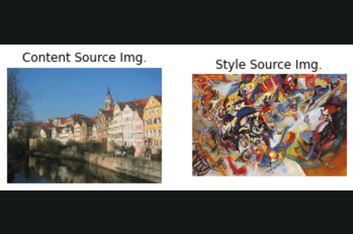

# Inversion-based Style Transfer Model

Implementation of Inversion-based Style Transfer Model based on [this paper](https://www.cv-foundation.org/openaccess/content_cvpr_2016/papers/Gatys_Image_Style_Transfer_CVPR_2016_paper.pdf). The deep network we use as a feature extractor is [SqueezeNet](https://arxiv.org/abs/1602.07360), a small model that has been trained on ImageNet. You could use any network, but we chose SqueezeNet here for its small size and efficiency.

Here are examples of input sourcing images (style then content) and then progressive stages of ouput images produced by this algorithm:

  

# Contents

[***Objective***](https://github.com/leob03/Style_Transfer#objective)

[***Concepts***](https://github.com/leob03/Style_Transfer#concepts)

[***Dependencies***](https://github.com/leob03/Style_Transfer#dependencies)

[***Getting started***](https://github.com/leob03/Style_Transfer#getting-started)

[***Loss functions***](https://github.com/leob03/Style_Transfer#loss-functions)

# Objective

**To take two images, and produce a new image that reflects the content of one but the artistic "style" of the other.**

We did this by first formulating a loss function that matches the content and style of each respective image in the feature space of a deep network, and then performing gradient descent on the pixels of the image itself.

  

# Concepts

* **Style Transfer**. This refers to the process of applying the artistic style of one image (style image) to the content of another image (content image) to generate a stylized output image that retains the content of the original image but has the artistic style of the style image.

* **Content and Style Representation**. The paper proposes separating content and style representations in a CNN. The content representation captures the arrangement of objects and their features in the image, while the style representation captures the texture and color information, which is done by analyzing correlations between features across different layers of the network.

* **Optimization Framework**. An optimization framework is used to minimize a loss function that measures the difference between the content, style, and generated images in terms of their representations in the CNN. This optimization alters the pixels of the generated image to minimize this loss, thereby achieving style transfer.

# Dependencies
**Python 3.10**, modern version of **PyTorch**, **numpy** and **scipy** module. Most of these are okay to install with **pip**. To install all dependencies at once, run the command `pip install -r requirements.txt`

I only tested this code with Ubuntu 20.04, but I tried to make it as generic as possible (e.g. use of **os** module for file system interactions etc. So it might work on Windows and Mac relatively easily.)

# Getting started

1. **Get the code.** `$ git clone` the repo and install the Python dependencies
2. **Train and Evaluate the trained model.** Run the training `$ train_test.py` and wait. You'll see that the learning code writes checkpoints into `cv/` and periodically print its status. 

# Loss functions

### Content Loss

We can generate an image that reflects the content of one image and the style of another by incorporating both in our loss function. We want to penalize deviations from the content of the content image and deviations from the style of the style image. We can then use this hybrid loss function to perform gradient descent **not on the parameters** of the model, but instead **on the pixel values** of our original image.

First, we wrote the content loss function. Content loss measures how much the feature map of the generated image differs from the feature map of the source image. We only care about the content representation of one layer of the network (say, layer $\ell$), that has feature maps $A^\ell \in \mathbb{R}^{1 \times C_\ell \times H_\ell \times W_\ell}$. $C_\ell$ is the number of filters/channels in layer $\ell$, $H_\ell$ and $W_\ell$ are the height and width. We will work with reshaped versions of these feature maps that combine all spatial positions into one dimension. Let $F^\ell \in \mathbb{R}^{C_\ell \times M_\ell}$ be the feature map for the current image and $P^\ell \in \mathbb{R}^{C_\ell \times M_\ell}$ be the feature map for the content source image where $M_\ell=H_\ell\times W_\ell$ is the number of elements in each feature map. Each row of $F^\ell$ or $P^\ell$ represents the vectorized activations of a particular filter, convolved over all positions of the image. Finally, let $w_c$ be the weight of the content loss term in the loss function.

Then the content loss is given by:

$L_c = w_c \times \sum_{i,j} (F_{ij}^{\ell} - P_{ij}^{\ell})^2$

### Style loss

Now we can tackle the style loss. For a given layer $\ell$, the style loss is defined as follows:

First, compute the Gram matrix G which represents the correlations between the responses of each filter, where F is as above. The Gram matrix is an approximation to the covariance matrix -- we want the activation statistics of our generated image to match the activation statistics of our style image, and matching the (approximate) covariance is one way to do that. There are a variety of ways you could do this, but the Gram matrix is nice because it's easy to compute and in practice shows good results.

Given a feature map $F^\ell$ of shape $(C_\ell, M_\ell)$, the Gram matrix has shape $(C_\ell, C_\ell)$ and its elements are given by:

$$G_{ij}^\ell  = \sum_k F^{\ell}_{ik} F^{\ell}_{jk}$$

Assuming $G^\ell$ is the Gram matrix from the feature map of the current image, $A^\ell$ is the Gram Matrix from the feature map of the source style image, and $w_\ell$ a scalar weight term, then the style loss for the layer $\ell$ is simply the weighted Euclidean distance between the two Gram matrices:

$$L_s^\ell = w_\ell \sum_{i, j} \left(G^\ell_{ij} - A^\ell_{ij}\right)^2$$

In practice we usually compute the style loss at a set of layers $\mathcal{L}$ rather than just a single layer $\ell$; then the total style loss is the sum of style losses at each layer:

$$L_s = \sum_{\ell \in \mathcal{L}} L_s^\ell$$

### Total-variation regularization

It turns out that it's helpful to also encourage smoothness in the image. We can do this by adding another term to our loss that penalizes wiggles or "total variation" in the pixel values.

You can compute the "total variation" as the sum of the squares of differences in the pixel values for all pairs of pixels that are next to each other (horizontally or vertically). Here we sum the total-variation regualarization for each of the 3 input channels (RGB), and weight the total summed loss by the total variation weight, $w_t$:

$$
L_{tv} = w_t \times \left(\sum_{c=1}^3\sum_{i=1}^{H-1}\sum_{j=1}^{W} (x_{i+1,j,c} - x_{i,j,c})^2 + \sum_{c=1}^3\sum_{i=1}^{H}\sum_{j=1}^{W - 1} (x_{i,j+1,c} - x_{i,j,c})^2\right)
$$

